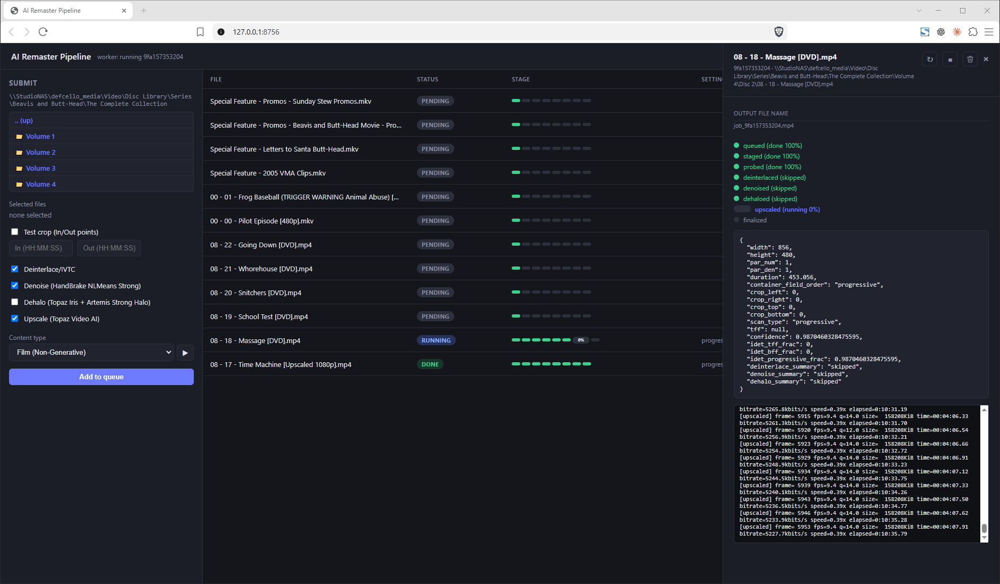

# AI Remaster Pipeline

A local pipeline for AI-upscaling an SD/interlaced video library, following a non-generative
upscaling workflow: **deinterlace/IVTC** → optional **denoise** → optional **dehalo** → **AI
upscale** → **finalize**. A FastAPI backend runs jobs from a SQLite-backed queue on a background
worker thread; a plain-JS dashboard (no build step) shows live progress over SSE.



The dashboard lets you browse a source library, queue files for processing, toggle each stage on
or off, pick a content-type preset, and watch per-stage progress and encoder logs update live as a
job runs.

## Stages

1. **Deinterlace/IVTC** — Hybrid's bundled QTGMC/VIVTC via VapourSynth
2. **Denoise** — HandBrake NLMeans
3. **Dehalo** — Topaz Iris + Artemis (removes ringing/halo artifacts from oversharpened DVD sources)
4. **Upscale** — Topaz Video AI, driven headlessly via its bundled ffmpeg

Each stage is independently toggleable, and a content-type preset (Film, Film Generative,
Animation) picks the tuned settings for that run.

## Running it

```bash
pip install -r requirements.txt
python -m app.server          # starts the server at http://127.0.0.1:8756
start_pipeline.bat            # same, plus opens the dashboard in Brave
```

There's no build step or automated test suite — verify changes by starting the server and running
a short clip through the dashboard.

## Notes

This is tightly coupled to tool installs (Topaz Video AI, Hybrid, HandBrake, MakeMKV) on one
specific Windows machine. See [CLAUDE.md](CLAUDE.md) for the full architecture, the job state
machine, and a long list of hard-won gotchas discovered while building this.
